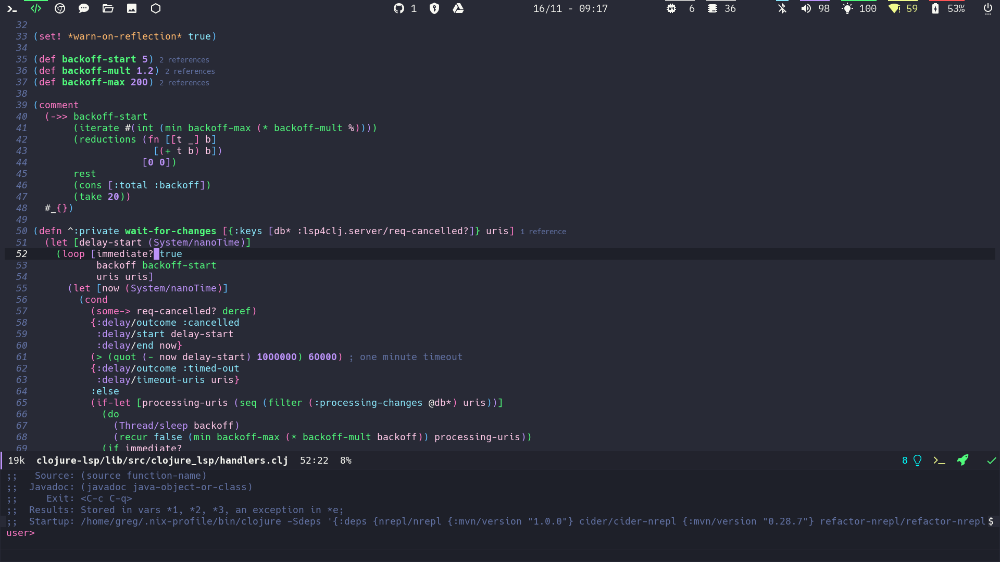
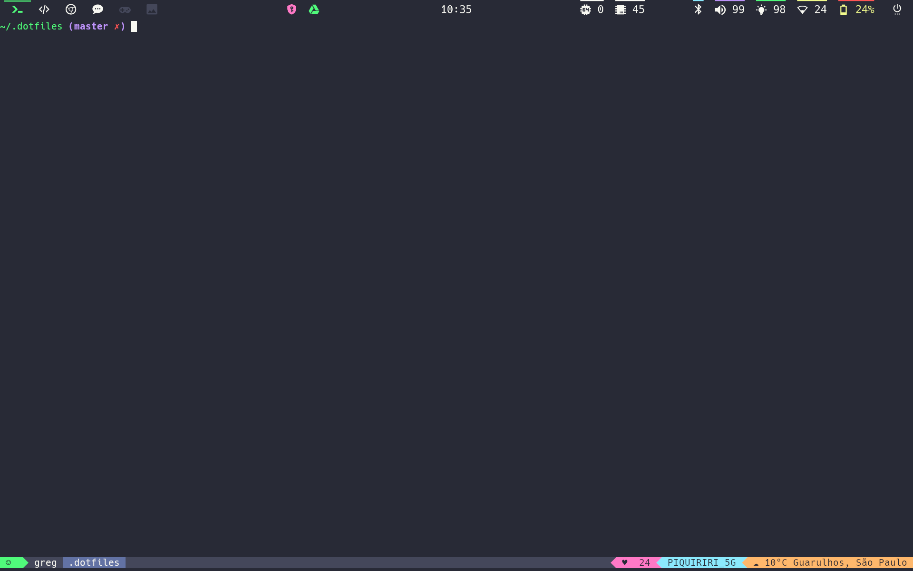

# Dotfiles
_**My whole Dracula themed Linux Configuration files**_

 

_For more screenshots check [here](screenshots)_

### Features

- [Dracula theme](https://draculatheme.com) on most everything
- [NixOS](https://nixos.org/) - NixOS configurations
- [NixOS Dracula wallpaper](background.jpg)
- [hyprland](https://hyprland.org/) - Window manager using Wayland.
- [waybar](https://github.com/Alexays/Waybar) - Customized bar
- [dunst](https://github.com/dunst-project/dunst) - Notifications handler service
- [rofi](https://github.com/davatorium/rofi) - Application launcher
- [networkmanager-dmenu](https://github.com/firecat53/networkmanager-dmenu) - Network manager application 
- [Doom Emacs](https://github.com/hlissner/doom-emacs) - Doom Emacs configurations 
- [Tmux](https://github.com/tmux/tmux/wiki) - Terminal window and session manager
- [zsh](https://ohmyz.sh/) - Z shell
- [scripts](scripts) - Custom scripts
